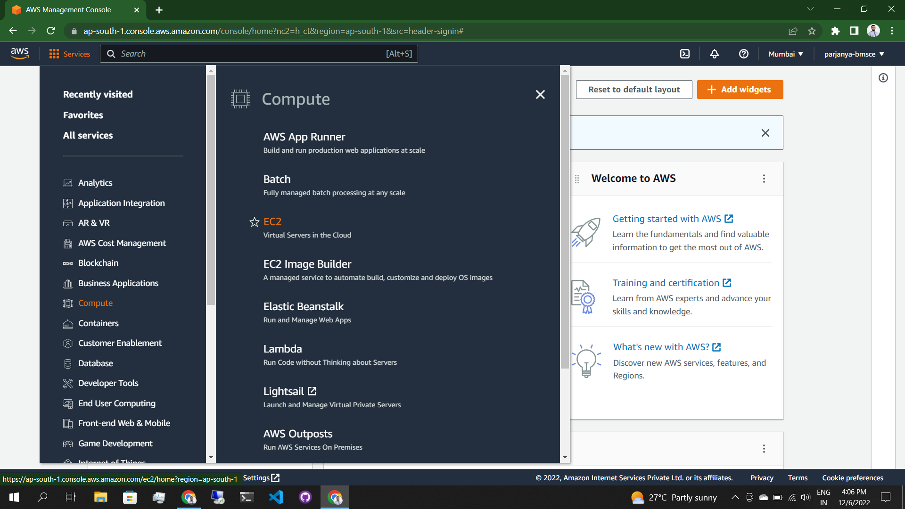
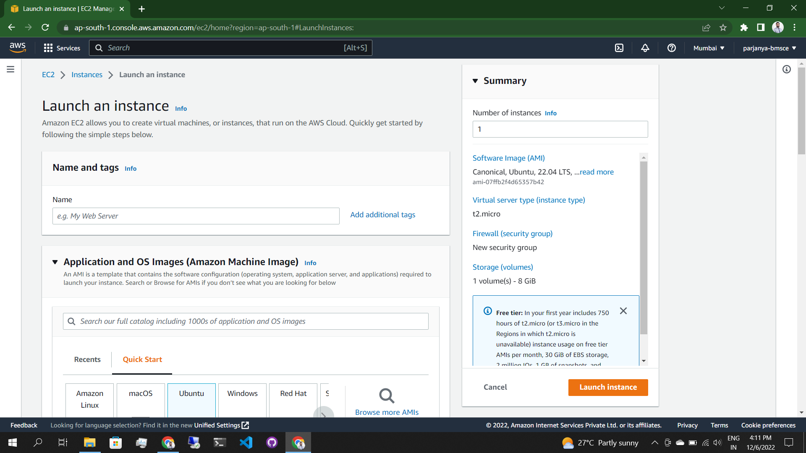
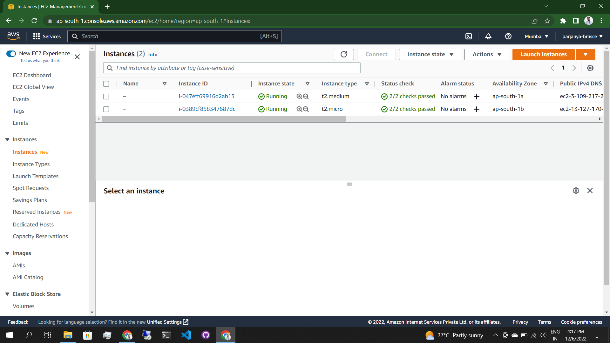
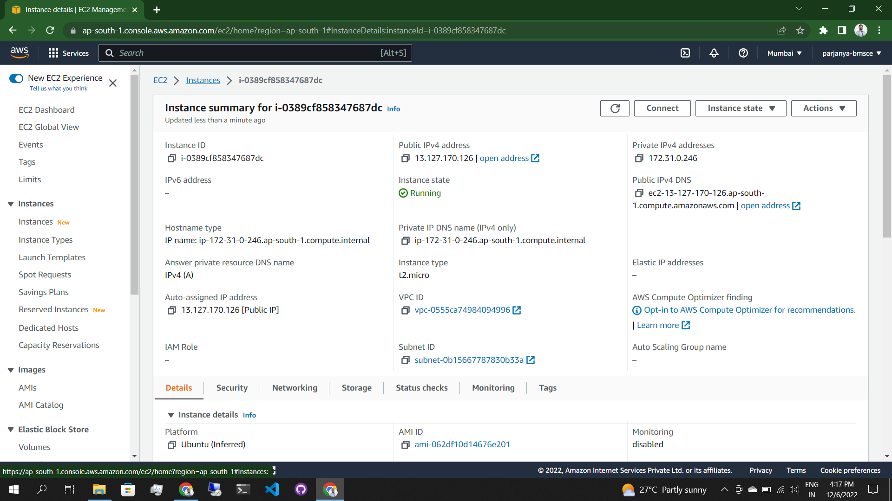
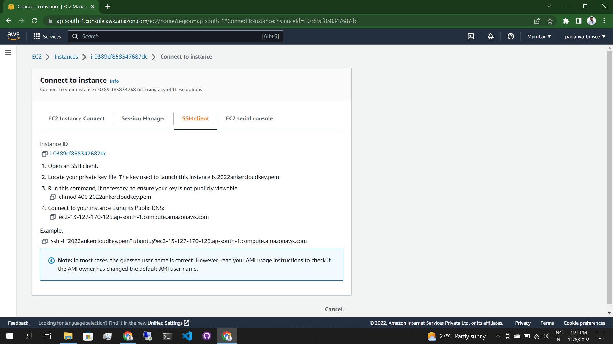
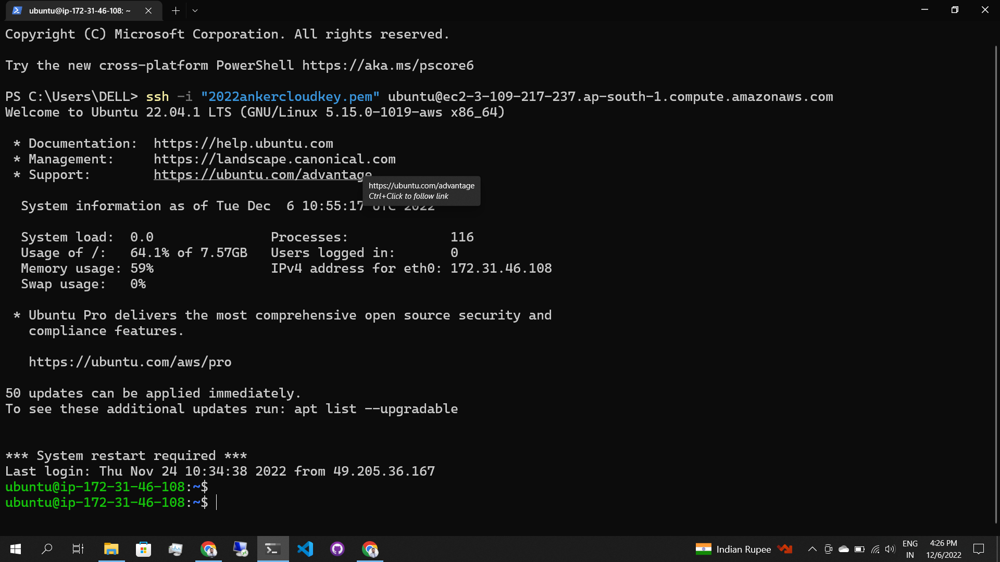

# Deployment Basics

Author: [Parjanya Modi](https://parjanyamodi.com)

## Table of Contents

1. [AWS Coure - AWS Partner: Accreditation (Technical)](#aws-course---aws-partner-accreditation-technical)
    - [Course Objectives](#course-objectives)
    - [Course Outline](#course-outline)
2. [AWS Course - AWS Partner: Cloud Economics Accreditation](#aws-course---aws-partner-cloud-economics-accreditation)
    - [Course Objectives](#course-objectives-1)
    - [Course Outline](#course-outline-1)
3. [AWS Course - AWS Partner: Sales Accreditation (Business)]()
    - [Course Objectives](#course-objectives-2)
    - [Course Outline](#course-outline-2)
4. [Production Server Set-up on AWS]()
    - [Setting up an AWS account]()
    - [Setting up an ec2 Instance]()
    - [Setting up a security group]()
    - [Deploying a nodeJS application]()
    - [Using Nginx for reverse proxy]()
5. [Using DevOps tools in a production environment]()
    - [Setting up Jenkins on ec2 Instance]()
    - [Creating GitHub webhook to trigger deploys]() 
    - [Using groovy scripts for testing and deployment]()
    - [Using `.sh` files to control the deploys over remote servers]()
6. [Deploying environment specific applications]()
    - [Using maven to build and deploy java projects from `.jar` files]()
    - [Integrating Apache Tomcat with Jenkins]()
7. [Containerization of Applications]()
    - [Using Docker to deploy application]()
    - [Using Kuberneters to deploy application]()

# AWS Course - AWS Partner: Accreditation (Technical)
+ ## <!-- Technical -->Course Objectives
    - Articulate the value of crucial Amazon Web Services (AWS) services and features
    - Apply AWS services toward customer solutions
    - Adopt AWS architectural and cost optimization best practices
    - Present AWS solutions to customers
    - Demonstrate the value of constructing proofs of concept (POCs)
    - Assemble an action plan for successful customer engagements
    - Identify AWS Partner Network (APN) resources for APN Partners
+ ## <!-- Technical -->Course Outline
    - Module 1: Course Overview
        * Course Overview
    - Module 2: Introduction to AWS Core Technologies
        * Benefits of Cloud Computing
        * AWS Global Infrastructure
        * Core Technologies: Compute
        * Core Technologies: Storage
        * Core Technologies: Databases
        * Core Technologies: Networking
        * Core Technologies: Security
    - Module 3: From Services to Solutions
        * Introduction to Solution Design
        * Addressing Customer Challenges
        * Migration Strategies
        * Architectural Best Practices
        * Other Solution Design Resources
        * Proposed Solution
    - Module 4: Presenting AWS Solutions to Customers
        * Customer Meeting Best Practices
        * Delivering a Proof of Concept
    - Module 5: Looking Ahead
        * Planning the Migration
        * Modernization
    - Module 6: AWS Partner Network Resources
        * AWS Partner Network Resources
    - Module 7: Course Review
        * Course Conclusion
        * Accreditation Test
        * Course Completion

# AWS Course - AWS Partner: Cloud Economics Accreditation
+ ## <!-- Cloud Economics -->Course Objectives
    - Explain the four pillars of the Cloud Value Framework and the framework’s partner value proposition
    - Explain why cost savings matters and show customers how they can lower their costs by migrating their workloads to AWS
    - Calculate and differentiate customers’ staff productivity as strategic versus tactical by migrating to AWS
    - Present components of operational resilience in the context of IT
    - Define business agility and how it allows businesses to innovate
    - Explain the key elements of cloud financial management
    - Explain four best practices of cost optimization
    - Use the Migration Portfolio Assessment (MPA) tool to show customers the cost savings and business value of migrating to the AWS Cloud
+ ## <!-- Technical --> Course Outline
    - Module 1: Introduction to Business Value
        * Cloud Value Framework
        * Cost savings
        * Staff Productivity
        * Operational resilience
        * Business agility
    - Module 2: Cost Savings Basics
        * Why cost savings matters
        * Lowering costs with AWS
        * Customer migration challenges
    - Module 3: Staff Productivity
        * Quantifying the impact AWS has on staff productivity versus traditional IT
        * Customer examples
    - Module 4: Operational Resilience
        * Four key areas of operational resilience
        * Benefits of improved operational resilience
        * Causes and effects of downtime
        * How AWS mitigates operational failures
        * Customer examples
    - Module 5: Business Agility
        * Key performance indicators to measure business agility
        * How increased business agility allows for innovation and decreased risks and costs
        * Customer examples
    - Module 6: Cloud Financial Management
        * Four key areas of cloud financial management
        * Measurement and accountability
        * Cost optimization
        * Planning and forecasting
        * Cloud financial operations
    - Module 7: Introduction to Migration Portfolio Assessment (MPA)
        * Who should use the MPA tool
        * When and how to use the MPA tool
        * How to access the MPA tool
    - Module 8: Cost Savings with MPA
        * How to add and manipulate data with the MPA tool
        * Cost savings analyses with the MPA tool

# AWS Course - AWS Partner: Sales Accreditation (Business)
+ ## <!-- Business -->Course Objectives
    - Describe the benefits of cloud computing and why customers choose AWS
    - Articulate the business value of the cloud, beyond cost savings
    - Respond to common customer objections to cloud adoption
    - Articulate best practices to co-sell with AWS sales teams
+ ## <!-- Business -->Course Outline
    - Module 1: Course Welcome
        * Overview and Welcome
    - Module 2: Cloud Concepts and AWS Services
        * Cloud Computing
        * Why Customers Choose AWS
        * Introduction to AWS Services 
        * Facilitating Digital Transformation
    - Module 3: Business Value
        * Business Value & Benchmarking
        * AWS Cloud Value Framework: Cost Saving
        * AWS Cloud Value Framework: Staff Productivity
        * AWS Cloud Value Framework: Operational Resilience
        * AWS Cloud Value Framework: Business Agility
    - Module 4: Cloud Objection Handling
        * Cloud Objections
        * Cost
        * Security, Compliance, and Privacy
        * Loss of control or visibility
        * Existing infrastructure
        * Skills gap
        * Vendor lock-in
        * Sustainability
        * Module Resources
    - Module 5: Co-selling with AWS
        * Co-selling Fundamentals
        * Working with AWS 
        * Best Practices 
        * AWS Partner Funding Programs
        * Module Resources
    - Module 6: Course Wrap-Up
        * Course Summary

# Production Server Set-up on AWS
+ ## Setting up an AWS account
    1. Create an AWS Account by visiting the link [Click here](https://aws.amazon.com/account/sign-up).
    2. Go to the menu and select ec2.
    
    3. Deploy a new ec2 instance and apply use-case-specific configuration in the portal.
    
    4. Configure the network, security group, storage and server credentails.
    5. Click on the `Launch Instance` button in `orange` color in order to launch the instance with required configuration.
    6. Go to the list of instances available in the AWS account and select the particular instance that you want to connect to.
    
    7. Click on the connect button at the top of the instance details.
    
    8. Copy the ssh command displayed and use it in the terminal or any ssh client software.
    
    9. Once connected to the server the terminal may look something like this.
    